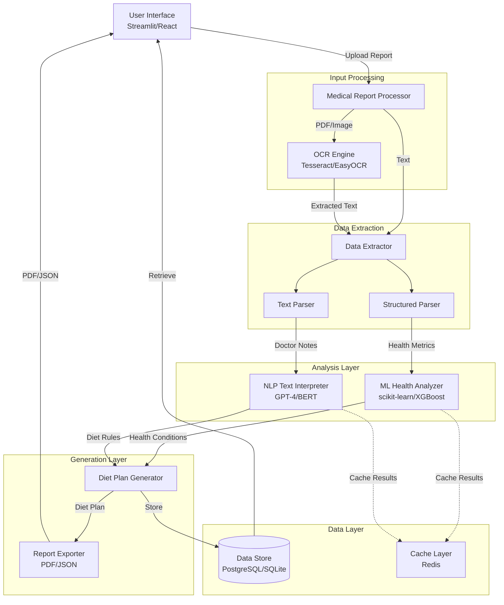

# Design Document: AI NutriCare System

## Overview

The AI NutriCare System is a comprehensive medical report analysis and personalized diet plan generation platform built in Python. The system employs a multi-stage pipeline architecture that processes medical reports through OCR, extracts structured and unstructured data, analyzes health conditions using machine learning, interprets medical instructions using AI/NLP, and generates personalized diet plans.

The system is designed with modularity and extensibility in mind, separating concerns across distinct components: report processing, data extraction, ML-based health analysis, NLP-based text interpretation, diet plan generation, data persistence, and user interface. This separation enables independent development, testing, and scaling of each component.

### Key Design Principles

1. **Pipeline Architecture**: Sequential processing stages with clear input/output contracts
2. **Separation of Concerns**: Distinct modules for OCR, ML, NLP, diet generation, and UI
3. **Data-Driven**: ML models and NLP systems trained on medical datasets
4. **Privacy-First**: Encryption at rest and in transit for sensitive health data
5. **Extensibility**: Plugin architecture for adding new ML models, NLP engines, and diet generation strategies
6. **Testability**: Each component designed for unit testing and property-based testing

## Architecture

### System Architecture Diagram



### Component Interaction Flow

1. **Input Stage**: User uploads medical report → Medical Report Processor validates and routes to OCR or direct extraction
2. **Extraction Stage**: OCR extracts text → Data Extractor parses into structured metrics and textual notes
3. **Analysis Stage**: ML Health Analyzer classifies conditions from metrics → NLP Text Interpreter converts notes to diet rules
4. **Generation Stage**: Diet Plan Generator combines analysis results with user preferences → Creates personalized diet plan
5. **Output Stage**: Report Exporter formats plan as PDF/JSON → User Interface displays and allows download
6. **Persistence Stage**: Data Store saves patient profile, reports, and diet plans for historical tracking

## Components and Interfaces

### 1. Medical Report Processor

**Responsibility**: Accept and validate medical reports in multiple formats, route to appropriate processing pipeline.

**Interface**:
```python
class MedicalReportProcessor:
    def accept_report(self, file: UploadedFile) -> ReportID:
        """
        Accept a medical report file and queue for processing.
        
        Args:
            file: Uploaded file (PDF, image, or text)
            
        Returns:
            ReportID: Unique identifier for tracking processing status
            
        Raises:
            FileSizeError: If file exceeds 10MB
            UnsupportedFormatError: If file format not supported
        """
        pass
    
    def get_processing_status(self, report_id: ReportID) -> ProcessingStatus:
        """Get current processing status of a report."""
        pass
    
    def route_to_pipeline(self, report_id: ReportID) -> ProcessingPipeline:
        """Determine appropriate processing pipeline based on file type."""
        pass
```

**Implementation Details**:
- File validation: Check size (max 10MB), format (PDF, JPEG, PNG, TIFF, TXT)
- Format detection: Use magic bytes and file extensions
- Queue management: Use task queue (Celery/RQ) for async processing
- Status tracking: Store processing state in Redis cache

### 2. OCR Engine

**Responsibility**: Extract text from scanned documents and images with high accuracy.

**Interface**:
```python
class OCREngine:
    def __init__(self, engine: str = "tesseract"):
        """
        Initialize OCR engine.
        
        Args:
            engine: OCR backend ("tesseract" or "easyocr")
        """
        pass
    
    def extract_text_from_pdf(self, pdf_path: Path) -> ExtractedText:
        """
        Extract text from PDF document.
        
        Args:
            pdf_path: Path to PDF file
            
        Returns:
            ExtractedText: Extracted text with page metadata
            
        Raises:
            UnreadableDocumentError: If document quality insufficient
        """
        pass
    
    def extract_text_from_image(self, image_path: Path) -> ExtractedText:
        """Extract text from image file."""
        pass
    
    def preprocess_image(self, image: Image) -> Image:
        """Apply preprocessing to improve OCR accuracy."""
        pass
```

**Implementation Details**:
- **Primary Engine**: Tesseract OCR with custom configuration
- **Fallback Engine**: EasyOCR for challenging documents
- **Preprocessing Pipeline**:
  - Grayscale conversion
  - Noise reduction (Gaussian blur)
  - Contrast enhancement (CLAHE)
  - Binarization (Otsu's method)
  - Deskewing (Hough transform)
- **PDF Handling**: Convert to images using pdf2image (300 DPI)
- **Multi-page Support**: Process pages in parallel, preserve order
- **Quality Check**: Confidence scoring, reject if < 60% average confidence

### 3. Data Extractor

**Responsibility**: Parse extracted text and identify structured health metrics and textual notes.

**Interface**:
```python
class DataExtractor:
    def extract_structured_data(self, text: str) -> StructuredHealthData:
        """
        Extract numeric health metrics from text.
        
        Args:
            text: Extracted text from medical report
            
        Returns:
            StructuredHealthData: Parsed health metrics with units
            
        Raises:
            InsufficientDataError: If no metrics found
        """
        pass
    
    def extract_textual_notes(self, text: str) -> List[TextualNote]:
        """Extract doctor notes, prescriptions, and recommendations."""
        pass
    
    def identify_metric_type(self, value: float, context: str) -> MetricType:
        """Identify metric type from value and surrounding context."""
        pass
```

**Implementation Details**:
- **Regex Patterns**: Define patterns for common health metrics
  - Blood Sugar: `glucose|blood sugar|fasting.*(\d+\.?\d*)\s*(mg/dl|mmol/l)`
  - Cholesterol: `cholesterol|ldl|hdl.*(\d+\.?\d*)\s*(mg/dl)`
  - BMI: `bmi|body mass index.*(\d+\.?\d*)`
  - Blood Pressure: `bp|blood pressure.*(\d+)/(\d+)\s*(mmhg)`
  - Hemoglobin: `hb|hemoglobin.*(\d+\.?\d*)\s*(g/dl)`
- **Unit Normalization**: Convert all metrics to standard units
- **Context Analysis**: Use surrounding words to disambiguate metric types
- **Section Detection**: Identify sections (Lab Results, Doctor Notes, Prescriptions)
- **Ambiguity Handling**: Flag values that match multiple patterns for manual review

### 4. ML Health Analyzer

**Responsibility**: Classify health conditions from numeric metrics using trained ML models.

**Interface**:
```python
class MLHealthAnalyzer:
    def __init__(self, model_registry: ModelRegistry):
        """Initialize with trained models from registry."""
        pass
    
    def classify_conditions(self, metrics: StructuredHealthData) -> List[HealthCondition]:
        """
        Classify health conditions from metrics.
        
        Args:
            metrics: Structured health metrics
            
        Returns:
            List of detected conditions with confidence scores
        """
        pass
    
    def detect_abnormal_values(self, metrics: StructuredHealthData) -> List[Alert]:
        """Generate alerts for metrics outside normal ranges."""
        pass
    
    def get_risk_assessment(self, conditions: List[HealthCondition]) -> RiskProfile:
        """Assess overall health risk from detected conditions."""
        pass
```

**Implementation Details**:
- **Model Architecture**:
  - Primary: Gradient Boosting (XGBoost/LightGBM) for high accuracy
  - Secondary: Random Forest for interpretability
  - Baseline: Logistic Regression for comparison
- **Feature Engineering**:
  - Standardization using StandardScaler
  - Feature selection based on importance scores
  - Interaction features (e.g., BMI × Age)
- **Training Strategy**:
  - 5-fold stratified cross-validation
  - Class balancing using SMOTE for minority classes
  - Hyperparameter tuning using GridSearchCV
  - Early stopping to prevent overfitting
- **Model Registry**:
  - Version control for models (MLflow)
  - A/B testing framework for model comparison
  - Automatic retraining triggers when accuracy < 85%
- **Threshold-Based Alerts**:
  - Critical: Red flag requiring immediate attention
  - Warning: Yellow flag suggesting monitoring
  - Normal: Green flag indicating healthy range
- **Supported Conditions**:
  - Diabetes (Type 1, Type 2, Prediabetes)
  - Hypertension (Stage 1, Stage 2)
  - Hyperlipidemia (High cholesterol, High triglycerides)
  - Obesity (Class I, II, III)
  - Anemia (Iron deficiency, B12 deficiency)

### 5. NLP Text Interpreter

**Responsibility**: Interpret doctor notes and prescriptions using AI/NLP, convert to actionable diet rules.

**Interface**:
```python
class NLPTextInterpreter:
    def __init__(self, model: str = "gpt-4"):
        """
        Initialize NLP interpreter.
        
        Args:
            model: NLP model ("gpt-4", "gpt-3.5-turbo", "bert")
        """
        pass
    
    def interpret_notes(self, notes: List[TextualNote]) -> List[DietRule]:
        """
        Convert textual notes to actionable diet rules.
        
        Args:
            notes: Doctor notes and prescriptions
            
        Returns:
            List of diet rules with priority levels
        """
        pass
    
    def extract_restrictions(self, notes: List[TextualNote]) -> List[DietaryRestriction]:
        """Extract strict dietary restrictions (allergies, intolerances)."""
        pass
    
    def extract_recommendations(self, notes: List[TextualNote]) -> List[DietaryRecommendation]:
        """Extract dietary recommendations and preferences."""
        pass
    
    def resolve_conflicts(self, rules: List[DietRule]) -> List[DietRule]:
        """Resolve conflicting diet rules using medical priority."""
        pass
```

**Implementation Details**:
- **Primary Model**: GPT-4 via OpenAI API
  - Prompt engineering for medical context
  - Few-shot learning with example medical notes
  - Temperature = 0.3 for consistent outputs
- **Fallback Model**: BERT-based medical NER model
  - Fine-tuned on medical text corpus
  - Entity extraction for conditions, medications, foods
- **Prompt Template**:
  ```
  You are a medical AI assistant. Extract dietary guidelines from the following doctor's notes.
  
  Notes: {notes}
  
  Extract:
  1. Strict restrictions (allergies, medical contraindications)
  2. Recommended foods and nutrients
  3. Foods to avoid or limit
  4. Portion size guidance
  
  Format as structured JSON with priority levels.
  ```
- **Rule Mapping**:
  - Map extracted instructions to food categories
  - Assign priority: REQUIRED (allergies), RECOMMENDED (health), OPTIONAL (preference)
  - Link to nutrient databases (USDA FoodData Central)
- **Conflict Resolution**:
  - Medical restrictions override preferences
  - More specific rules override general rules
  - Recent notes override older notes
- **Caching Strategy**:
  - Cache common note patterns to reduce API calls
  - Cache TTL: 24 hours
  - Cache invalidation on model updates

### 6. Diet Plan Generator

**Responsibility**: Generate personalized diet plans combining ML insights, NLP rules, and user preferences.

**Interface**:
```python
class DietPlanGenerator:
    def __init__(self, food_database: FoodDatabase):
        """Initialize with food and nutrition database."""
        pass
    
    def generate_plan(
        self,
        health_conditions: List[HealthCondition],
        diet_rules: List[DietRule],
        preferences: UserPreferences
    ) -> DietPlan:
        """
        Generate personalized daily diet plan.
        
        Args:
            health_conditions: Detected health conditions
            diet_rules: Extracted dietary guidelines
            preferences: User dietary preferences and allergies
            
        Returns:
            DietPlan: Complete daily meal plan with nutrition info
        """
        pass
    
    def balance_macronutrients(
        self,
        meals: List[Meal],
        target_ratios: MacronutrientRatios
    ) -> List[Meal]:
        """Balance protein, carbs, fats according to health needs."""
        pass
    
    def calculate_portions(self, food_item: Food, target_calories: float) -> Portion:
        """Calculate appropriate portion sizes."""
        pass
```

**Implementation Details**:
- **Food Database**: USDA FoodData Central API
  - 350,000+ food items with detailed nutrition
  - Search by name, category, nutrients
  - Custom food additions for regional cuisines
- **Meal Structure**:
  - Breakfast: 25% daily calories
  - Lunch: 35% daily calories
  - Snack: 10% daily calories
  - Dinner: 30% daily calories
- **Macronutrient Targets** (condition-specific):
  - Diabetes: 40% carbs, 30% protein, 30% fat (low glycemic index)
  - Hypertension: Low sodium (<2300mg), high potassium
  - Hyperlipidemia: Low saturated fat (<7% calories), high fiber
  - Obesity: Caloric deficit (500-750 kcal below TDEE)
- **Constraint Satisfaction**:
  - Hard constraints: Allergies, medical restrictions
  - Soft constraints: Preferences, cultural considerations
  - Optimization: Maximize nutrition diversity, minimize cost
- **Generation Algorithm**:
  1. Calculate daily caloric needs (Mifflin-St Jeor equation)
  2. Determine macronutrient targets based on conditions
  3. Filter food database by restrictions
  4. Select foods using constraint satisfaction
  5. Optimize for nutrition balance and variety
  6. Calculate portions to meet targets
- **Variety Optimization**:
  - Rotate food items across days
  - Ensure micronutrient diversity
  - Consider seasonal availability

### 7. Report Exporter

**Responsibility**: Export diet plans in PDF and JSON formats.

**Interface**:
```python
class ReportExporter:
    def export_pdf(self, diet_plan: DietPlan, patient_info: PatientInfo) -> bytes:
        """
        Generate PDF report of diet plan.
        
        Args:
            diet_plan: Generated diet plan
            patient_info: Patient information for header
            
        Returns:
            PDF file as bytes
        """
        pass
    
    def export_json(self, diet_plan: DietPlan) -> str:
        """Export diet plan as structured JSON."""
        pass
    
    def validate_json_schema(self, json_data: str) -> bool:
        """Validate JSON against defined schema."""
        pass
```

**Implementation Details**:
- **PDF Generation**: ReportLab library
  - Professional medical report template
  - Sections: Patient Info, Health Summary, Diet Plan, Nutritional Breakdown
  - Visual elements: Charts for macronutrients, tables for meals
  - Branding: Logo, color scheme, footer with disclaimers
- **JSON Schema**:
  ```json
  {
    "patient_id": "string",
    "generated_date": "ISO8601",
    "health_summary": {
      "conditions": ["string"],
      "alerts": [{"metric": "string", "status": "string", "message": "string"}]
    },
    "diet_plan": {
      "daily_calories": "number",
      "meals": [
        {
          "meal_type": "breakfast|lunch|snack|dinner",
          "foods": [
            {
              "name": "string",
              "portion": "string",
              "calories": "number",
              "protein_g": "number",
              "carbs_g": "number",
              "fat_g": "number"
            }
          ]
        }
      ]
    },
    "restrictions": ["string"],
    "recommendations": ["string"]
  }
  ```
- **Performance**: Generate PDF in <5 seconds, JSON in <2 seconds

### 8. Data Store

**Responsibility**: Persist patient data, medical reports, and diet plans with encryption.

**Interface**:
```python
class DataStore:
    def save_patient(self, patient: PatientProfile) -> PatientID:
        """Save patient profile, return unique ID."""
        pass
    
    def save_diet_plan(self, patient_id: PatientID, plan: DietPlan) -> PlanID:
        """Associate diet plan with patient."""
        pass
    
    def get_patient_history(self, patient_id: PatientID) -> PatientHistory:
        """Retrieve all reports and plans for patient."""
        pass
    
    def delete_patient_data(self, patient_id: PatientID) -> bool:
        """Permanently delete all patient data."""
        pass
```

**Implementation Details**:
- **Database**: PostgreSQL (production) / SQLite (development)
- **Schema**:
  - `patients`: id, encrypted_name, encrypted_dob, created_at
  - `medical_reports`: id, patient_id, report_type, encrypted_data, uploaded_at
  - `health_metrics`: id, report_id, metric_type, value, unit, extracted_at
  - `diet_plans`: id, patient_id, plan_data, generated_at
  - `audit_log`: id, user_id, action, resource_id, timestamp
- **Encryption**:
  - At-rest: AES-256 encryption for sensitive fields
  - Key management: AWS KMS or HashiCorp Vault
  - In-transit: TLS 1.3 for all connections
- **Indexing**: B-tree indexes on patient_id, created_at for fast queries
- **Backup**: Daily automated backups with 30-day retention

### 9. User Interface

**Responsibility**: Provide intuitive interface for uploading reports and viewing diet plans.

**Interface** (Streamlit):
```python
def render_upload_page():
    """Render file upload interface with drag-and-drop."""
    pass

def render_data_summary(health_data: StructuredHealthData, alerts: List[Alert]):
    """Display extracted health metrics and alerts."""
    pass

def render_diet_plan(diet_plan: DietPlan):
    """Display personalized diet plan with visualizations."""
    pass

def render_export_options(diet_plan: DietPlan):
    """Provide PDF and JSON export buttons."""
    pass
```

**Implementation Details**:
- **Framework**: Streamlit (Python) for rapid development
  - Alternative: React + FastAPI for production scalability
- **Pages**:
  1. Upload: Drag-and-drop file upload, format validation, progress bar
  2. Review: Display extracted metrics, allow corrections, show alerts
  3. Diet Plan: Show meal plan, nutrition charts, export options
  4. History: View past reports and plans
- **Visualizations**:
  - Plotly charts for macronutrient breakdown
  - Color-coded alerts (red/yellow/green)
  - Progress indicators for processing status
- **Responsive Design**: Mobile-friendly layout
- **Accessibility**: WCAG 2.1 AA compliance (keyboard navigation, screen reader support)

## Data Models

### Core Data Structures

```python
from dataclasses import dataclass
from typing import List, Optional, Dict
from enum import Enum
from datetime import datetime

class MetricType(Enum):
    GLUCOSE = "glucose"
    CHOLESTEROL_TOTAL = "cholesterol_total"
    CHOLESTEROL_LDL = "cholesterol_ldl"
    CHOLESTEROL_HDL = "cholesterol_hdl"
    TRIGLYCERIDES = "triglycerides"
    BMI = "bmi"
    BLOOD_PRESSURE_SYSTOLIC = "bp_systolic"
    BLOOD_PRESSURE_DIASTOLIC = "bp_diastolic"
    HEMOGLOBIN = "hemoglobin"
    HBA1C = "hba1c"

class AlertSeverity(Enum):
    CRITICAL = "critical"
    WARNING = "warning"
    NORMAL = "normal"

class ConditionType(Enum):
    DIABETES_TYPE1 = "diabetes_type1"
    DIABETES_TYPE2 = "diabetes_type2"
    PREDIABETES = "prediabetes"
    HYPERTENSION_STAGE1 = "hypertension_stage1"
    HYPERTENSION_STAGE2 = "hypertension_stage2"
    HYPERLIPIDEMIA = "hyperlipidemia"
    OBESITY_CLASS1 = "obesity_class1"
    OBESITY_CLASS2 = "obesity_class2"
    OBESITY_CLASS3 = "obesity_class3"
    ANEMIA = "anemia"

class RulePriority(Enum):
    REQUIRED = "required"  # Medical restrictions, allergies
    RECOMMENDED = "recommended"  # Health-based guidelines
    OPTIONAL = "optional"  # Preferences

class MealType(Enum):
    BREAKFAST = "breakfast"
    LUNCH = "lunch"
    SNACK = "snack"
    DINNER = "dinner"

@dataclass
class HealthMetric:
    metric_type: MetricType
    value: float
    unit: str
    extracted_at: datetime
    confidence: float  # OCR confidence score

@dataclass
class StructuredHealthData:
    metrics: List[HealthMetric]
    report_id: str
    extraction_timestamp: datetime

@dataclass
class TextualNote:
    content: str
    section: str  # "doctor_notes", "prescription", "recommendation"
    page_number: Optional[int]

@dataclass
class Alert:
    metric_type: MetricType
    severity: AlertSeverity
    message: str
    recommended_action: Optional[str]

@dataclass
class HealthCondition:
    condition_type: ConditionType
    confidence: float  # ML model confidence
    detected_at: datetime
    contributing_metrics: List[MetricType]

@dataclass
class DietRule:
    rule_text: str
    priority: RulePriority
    food_categories: List[str]  # "proteins", "carbs", "fats", "dairy", etc.
    action: str  # "include", "exclude", "limit"
    source: str  # "ml_analysis", "nlp_extraction", "user_preference"

@dataclass
class DietaryRestriction:
    restriction_type: str  # "allergy", "intolerance", "medical", "religious"
    restricted_items: List[str]
    severity: str  # "strict", "moderate"

@dataclass
class Food:
    name: str
    fdc_id: Optional[str]  # USDA FoodData Central ID
    calories: float
    protein_g: float
    carbs_g: float
    fat_g: float
    fiber_g: float
    sodium_mg: float
    sugar_g: float
    category: str

@dataclass
class Portion:
    food: Food
    amount: float
    unit: str  # "g", "ml", "cup", "piece"
    calories: float
    protein_g: float
    carbs_g: float
    fat_g: float

@dataclass
class Meal:
    meal_type: MealType
    portions: List[Portion]
    total_calories: float
    total_protein_g: float
    total_carbs_g: float
    total_fat_g: float

@dataclass
class MacronutrientRatios:
    protein_percent: float
    carbs_percent: float
    fat_percent: float

@dataclass
class DietPlan:
    plan_id: str
    patient_id: str
    generated_at: datetime
    daily_calories: float
    macronutrient_targets: MacronutrientRatios
    meals: List[Meal]
    restrictions: List[DietaryRestriction]
    recommendations: List[str]
    health_conditions: List[HealthCondition]

@dataclass
class UserPreferences:
    dietary_style: Optional[str]  # "vegetarian", "vegan", "keto", "paleo", etc.
    allergies: List[str]
    dislikes: List[str]
    cultural_preferences: List[str]

@dataclass
class PatientProfile:
    patient_id: str
    age: int
    gender: str
    height_cm: float
    weight_kg: float
    activity_level: str  # "sedentary", "light", "moderate", "active", "very_active"
    preferences: UserPreferences
    created_at: datetime
```

## Correctness Properties


*A property is a characteristic or behavior that should hold true across all valid executions of a system—essentially, a formal statement about what the system should do. Properties serve as the bridge between human-readable specifications and machine-verifiable correctness guarantees.*

### Property Reflection

After analyzing all 100 acceptance criteria, I identified several areas of redundancy:

1. **File acceptance properties (1.1, 1.2, 1.3)** can be combined into a single property about accepting valid file formats
2. **OCR accuracy properties (2.1, 2.2)** are essentially the same property applied to different input types
3. **Data extraction completeness (3.1, 4.1)** both test extraction of different data types but share the same pattern
4. **Output format validation (3.4, 8.4, 12.3)** all test JSON schema validation - can be generalized
5. **Alert generation properties (6.2, 6.4)** both test alert content and can be combined
6. **NLP extraction properties (7.3, 7.4)** test the same extraction mechanism with different priorities
7. **UI display properties** (14.1-14.4, 15.1-15.4) test similar rendering patterns
8. **Performance properties** (20.1, 20.2, 20.4, 20.5) all test timing constraints

After reflection, I've consolidated 100 acceptance criteria into 45 unique, non-redundant properties that provide comprehensive coverage without logical overlap.

### Core Properties

**Property 1: Valid file format acceptance**
*For any* file with a supported format (PDF, JPEG, PNG, TIFF, TXT) and size ≤10MB, the Medical_Report_Processor should accept and queue it for processing.
**Validates: Requirements 1.1, 1.2, 1.3**

**Property 2: File size rejection**
*For any* file exceeding 10MB, the Medical_Report_Processor should reject it and return an error message indicating the size limit.
**Validates: Requirements 1.4**

**Property 3: Unsupported format rejection**
*For any* file with an unsupported format, the Medical_Report_Processor should reject it and return a list of supported formats.
**Validates: Requirements 1.5**

**Property 4: OCR accuracy threshold**
*For any* readable document (PDF or image) with sufficient quality, the OCR_Engine should extract text with at least 90% character accuracy when compared to ground truth.
**Validates: Requirements 2.1, 2.2**

**Property 5: OCR quality error handling**
*For any* document with insufficient image quality (blurred, low resolution, heavily degraded), the OCR_Engine should return an error indicating the quality issue.
**Validates: Requirements 2.3**

**Property 6: OCR to extraction pipeline**
*For any* document processed by OCR_Engine, the extracted text should be passed to Data_Extractor without loss of content.
**Validates: Requirements 2.4**

**Property 7: Page order preservation**
*For any* multi-page document, the OCR_Engine should preserve the original page order in the extracted text output.
**Validates: Requirements 2.5**

**Property 8: Health metric extraction completeness**
*For any* text containing numeric health metrics with standard medical terminology, the Data_Extractor should identify and extract all metrics with their values and units.
**Validates: Requirements 3.1**

**Property 9: Metric type classification accuracy**
*For any* extracted health metric, the Data_Extractor should correctly associate it with the appropriate MetricType (glucose, cholesterol, BMI, etc.) based on context.
**Validates: Requirements 3.2**

**Property 10: Ambiguous value flagging**
*For any* numeric value that could match multiple metric types without clear context, the Data_Extractor should flag it for manual review.
**Validates: Requirements 3.3**

**Property 11: Structured data JSON output**
*For any* extraction result, the Data_Extractor should output valid JSON that conforms to the StructuredHealthData schema.
**Validates: Requirements 3.4, 8.4, 12.3**

**Property 12: Insufficient data error handling**
*For any* text containing no identifiable health metrics, the Data_Extractor should return an error indicating insufficient structured data.
**Validates: Requirements 3.5**

**Property 13: Textual notes extraction**
*For any* text containing doctor notes, prescriptions, or recommendations, the Data_Extractor should identify and extract all note sections.
**Validates: Requirements 4.1**

**Property 14: Note context preservation**
*For any* extracted textual notes, the Data_Extractor should preserve the original relationships and context between note sections.
**Validates: Requirements 4.2**

**Property 15: Metric and note separation**
*For any* extraction result, numeric health metrics and textual notes should be in separate output structures.
**Validates: Requirements 4.3**

**Property 16: Encrypted content exclusion**
*For any* text containing encrypted or redacted sections, the Data_Extractor should exclude those sections from extraction.
**Validates: Requirements 4.4**

**Property 17: ML classification execution**
*For any* set of numeric health metrics, the ML_Health_Analyzer should produce a classification result using the trained ML model.
**Validates: Requirements 5.1**

**Property 18: Critical condition flagging**
*For any* health metrics indicating a critical condition (e.g., glucose ≥126 mg/dL for diabetes), the ML_Health_Analyzer should flag it with high priority.
**Validates: Requirements 5.3**

**Property 19: Classification output structure**
*For any* classification result, the ML_Health_Analyzer should output a list of HealthCondition objects, each with a confidence score between 0 and 1.
**Validates: Requirements 5.4**

**Property 20: Incomplete data handling**
*For any* incomplete set of health metrics, the ML_Health_Analyzer should classify based on available data and explicitly indicate which metrics are missing.
**Validates: Requirements 5.5**

**Property 21: Threshold comparison execution**
*For any* health metric, the ML_Health_Analyzer should compare it against established medical thresholds for that metric type.
**Validates: Requirements 6.1**

**Property 22: Abnormal value alert generation**
*For any* health metric exceeding normal range thresholds, the ML_Health_Analyzer should generate an Alert with severity level, message, and recommended action.
**Validates: Requirements 6.2, 6.4**

**Property 23: Alert prioritization by severity**
*For any* set of multiple abnormal health metrics, the ML_Health_Analyzer should order alerts by medical severity (critical before warning).
**Validates: Requirements 6.3**

**Property 24: NLP model invocation**
*For any* textual notes input, the NLP_Text_Interpreter should process them using the configured NLP model (GPT-4/5 or BERT).
**Validates: Requirements 7.1**

**Property 25: Dietary restriction extraction with priority**
*For any* textual notes containing dietary restrictions (allergies, intolerances), the NLP_Text_Interpreter should extract them as DietRule objects with REQUIRED priority.
**Validates: Requirements 7.3**

**Property 26: Dietary recommendation extraction**
*For any* textual notes containing dietary recommendations, the NLP_Text_Interpreter should extract them as DietRule objects with RECOMMENDED priority.
**Validates: Requirements 7.4**

**Property 27: Ambiguous instruction flagging**
*For any* textual notes containing ambiguous or contradictory dietary instructions, the NLP_Text_Interpreter should flag them for manual review.
**Validates: Requirements 7.5**

**Property 28: Diet rule to food category mapping**
*For any* extracted DietRule, the NLP_Text_Interpreter should map it to at least one food category (proteins, carbs, fats, dairy, etc.).
**Validates: Requirements 8.1**

**Property 29: Diet rule priority assignment**
*For any* extracted DietRule, the NLP_Text_Interpreter should assign a priority level (REQUIRED, RECOMMENDED, or OPTIONAL).
**Validates: Requirements 8.2**

**Property 30: Diet rule conflict resolution**
*For any* set of conflicting DietRules, the NLP_Text_Interpreter should resolve conflicts by prioritizing REQUIRED over RECOMMENDED over OPTIONAL.
**Validates: Requirements 8.3**

**Property 31: Diet plan meal structure**
*For any* generated DietPlan, it should contain exactly four meal types: breakfast, lunch, snack, and dinner.
**Validates: Requirements 9.1**

**Property 32: Diet plan rule compliance**
*For any* generated DietPlan and its associated DietRules, all meals should comply with the rules (no excluded foods, required foods included).
**Validates: Requirements 9.2**

**Property 33: Macronutrient balance**
*For any* generated DietPlan for a specific health condition, the macronutrient ratios should fall within the acceptable ranges for that condition.
**Validates: Requirements 9.3**

**Property 34: Meal completeness**
*For any* Meal in a DietPlan, it should include portion sizes and caloric information for all food items.
**Validates: Requirements 9.4**

**Property 35: Medical restriction priority**
*For any* conflict between medical restrictions and user preferences, the Diet_Plan_Generator should prioritize medical restrictions.
**Validates: Requirements 9.5, 10.3**

**Property 36: User preference incorporation**
*For any* UserPreferences provided (vegetarian, vegan, keto, etc.), the generated DietPlan should reflect those preferences where they don't conflict with medical requirements.
**Validates: Requirements 10.1**

**Property 37: Allergy exclusion (Safety Critical)**
*For any* food item in a generated DietPlan, it should not contain any ingredients listed in the user's allergy list.
**Validates: Requirements 10.2**

**Property 38: Alternative recommendations**
*For any* situation where both user preferences and medical requirements cannot be simultaneously satisfied, the Diet_Plan_Generator should provide alternative food recommendations.
**Validates: Requirements 10.4**

**Property 39: PDF generation completeness**
*For any* DietPlan exported to PDF, the PDF should contain patient information, health summary, and all daily meal plans.
**Validates: Requirements 11.1, 11.2**

**Property 40: PDF generation performance**
*For any* DietPlan, PDF generation should complete within 5 seconds.
**Validates: Requirements 11.4**

**Property 41: PDF generation error handling**
*For any* error during PDF generation, the Report_Exporter should return a descriptive error message indicating the failure reason.
**Validates: Requirements 11.5**

**Property 42: JSON export completeness**
*For any* DietPlan exported to JSON, the JSON should include all diet plan data (meals, portions, nutrients, restrictions, recommendations).
**Validates: Requirements 12.1, 12.2**

**Property 43: JSON generation performance**
*For any* DietPlan, JSON generation should complete within 2 seconds.
**Validates: Requirements 12.4**

**Property 44: UI upload feedback**
*For any* file upload operation, the User_Interface should display progress indicators during upload and status messages upon completion or failure.
**Validates: Requirements 13.2, 13.3, 13.4**

**Property 45: Health data visualization**
*For any* StructuredHealthData displayed in the User_Interface, abnormal values should be visually distinguished (highlighted, color-coded) from normal values.
**Validates: Requirements 14.2, 14.4**

**Property 46: Diet plan UI organization**
*For any* DietPlan displayed in the User_Interface, meals should be organized by meal type and include all nutritional information.
**Validates: Requirements 15.1, 15.2**

**Property 47: Diet plan visualization**
*For any* DietPlan displayed in the User_Interface, macronutrient balance should be represented visually (charts, graphs).
**Validates: Requirements 15.4**

**Property 48: Patient data persistence with unique ID**
*For any* PatientProfile saved to the Data_Store, it should be persisted with a unique patient identifier that can be used for retrieval.
**Validates: Requirements 16.1**

**Property 49: Diet plan association**
*For any* DietPlan saved to the Data_Store, it should be correctly associated with its corresponding PatientProfile and include a timestamp.
**Validates: Requirements 16.2**

**Property 50: Data encryption at rest**
*For any* sensitive health information stored in the Data_Store, it should be encrypted using AES-256 encryption.
**Validates: Requirements 16.3, 17.2**

**Property 51: Patient history retrieval**
*For any* patient identifier, querying the Data_Store should retrieve all associated medical reports and diet plans ordered by date (most recent first).
**Validates: Requirements 16.4**

**Property 52: Duplicate patient prevention**
*For any* attempt to create a duplicate PatientProfile (same identifying information), the Data_Store should prevent creation and return the existing patient identifier.
**Validates: Requirements 16.5**

**Property 53: TLS encryption for data transmission**
*For any* network communication involving patient data, the system should use TLS 1.2 or higher.
**Validates: Requirements 17.3**

**Property 54: Access authentication and logging**
*For any* access to patient data, the system should authenticate the user and create an audit log entry with timestamp and user identifier.
**Validates: Requirements 17.4**

**Property 55: Complete data deletion**
*For any* patient data deletion request, the Data_Store should permanently remove all associated records (patient profile, reports, diet plans) such that they cannot be recovered.
**Validates: Requirements 17.5**

**Property 56: Cross-validation in model training**
*For any* ML model training session, the ML_Health_Analyzer should use stratified k-fold cross-validation with k ≥ 5.
**Validates: Requirements 18.1**

**Property 57: Model evaluation metrics**
*For any* trained ML model validation, the ML_Health_Analyzer should report accuracy, precision, recall, and F1-score.
**Validates: Requirements 18.2**

**Property 58: Model retraining flag**
*For any* ML model with validation accuracy below 85%, the ML_Health_Analyzer should flag it as requiring retraining.
**Validates: Requirements 18.3**

**Property 59: Model versioning**
*For any* trained ML model saved to storage, it should include version metadata (version number, training date, feature schema).
**Validates: Requirements 18.4**

**Property 60: Model compatibility verification**
*For any* ML model loaded from storage, the ML_Health_Analyzer should verify its feature schema is compatible with the current data schema.
**Validates: Requirements 18.5**

**Property 61: Error logging completeness**
*For any* error encountered by any component, an error log entry should be created containing timestamp, component name, error context, and stack trace.
**Validates: Requirements 19.1**

**Property 62: Pipeline failure recovery**
*For any* processing pipeline failure, the input data should be preserved and the system should allow retry without requiring re-upload.
**Validates: Requirements 19.2**

**Property 63: OCR failure fallback**
*For any* OCR_Engine failure, the system should notify the user and provide an option for manual data entry.
**Validates: Requirements 19.3**

**Property 64: ML failure fallback**
*For any* ML_Health_Analyzer classification failure, the system should fall back to rule-based threshold analysis.
**Validates: Requirements 19.4**

**Property 65: NLP failure fallback**
*For any* NLP_Text_Interpreter processing failure, the system should provide an interface for manual DietRule entry.
**Validates: Requirements 19.5**

**Property 66: Single-page processing performance**
*For any* single-page medical report, end-to-end processing (upload to diet plan generation) should complete within 30 seconds.
**Validates: Requirements 20.1**

**Property 67: Multi-page processing performance**
*For any* multi-page medical report, end-to-end processing should complete within 60 seconds.
**Validates: Requirements 20.2**

**Property 68: Concurrent processing scalability**
*For any* set of N concurrent report uploads, the system should process them with throughput degradation no worse than O(N) (linear scaling).
**Validates: Requirements 20.3**

**Property 69: Diet plan generation performance**
*For any* set of health conditions and diet rules, the Diet_Plan_Generator should complete generation within 10 seconds.
**Validates: Requirements 20.4**

## Error Handling

### Error Categories

1. **Input Validation Errors**
   - File size exceeded
   - Unsupported file format
   - Corrupted file
   - Missing required fields

2. **Processing Errors**
   - OCR extraction failure (poor quality)
   - Insufficient data extracted
   - ML model prediction failure
   - NLP API timeout or rate limit

3. **Data Errors**
   - Ambiguous metric values
   - Contradictory diet rules
   - Impossible constraint satisfaction
   - Database connection failure

4. **System Errors**
   - Out of memory
   - Disk space exhausted
   - Network timeout
   - Service unavailable

### Error Handling Strategy

**Graceful Degradation**:
- OCR failure → Manual data entry option
- ML failure → Rule-based threshold analysis
- NLP failure → Manual diet rule entry
- Database failure → In-memory caching with retry

**User Communication**:
- All errors include descriptive messages
- Suggest resolution steps when possible
- Provide support contact for unrecoverable errors

**Logging and Monitoring**:
- All errors logged with full context
- Critical errors trigger alerts
- Error rates monitored for system health

**Retry Logic**:
- Transient failures (network, API rate limits) → Exponential backoff retry
- Permanent failures (invalid data) → No retry, user notification
- Maximum 3 retry attempts for transient failures

## Testing Strategy

### Dual Testing Approach

The AI NutriCare System requires both unit testing and property-based testing for comprehensive coverage:

**Unit Tests**: Focus on specific examples, edge cases, and integration points
- Specific medical report examples with known expected outputs
- Edge cases: empty files, malformed data, boundary values
- Error conditions: invalid inputs, service failures
- Integration tests: Component interactions, database operations

**Property-Based Tests**: Verify universal properties across all inputs
- Generate random medical reports with varying formats and content
- Test properties hold for all valid inputs (100+ iterations per property)
- Catch edge cases that manual test design might miss
- Validate invariants and correctness properties

### Property-Based Testing Configuration

**Framework**: Hypothesis (Python)
- Minimum 100 iterations per property test
- Shrinking enabled to find minimal failing examples
- Seed-based reproducibility for debugging

**Test Tagging**: Each property test must reference its design property
```python
@given(health_metrics=st.builds(StructuredHealthData))
@settings(max_examples=100)
def test_ml_classification_execution(health_metrics):
    """
    Feature: ai-nutricare-system, Property 17: ML classification execution
    For any set of numeric health metrics, the ML_Health_Analyzer should 
    produce a classification result using the trained ML model.
    """
    result = ml_analyzer.classify_conditions(health_metrics)
    assert isinstance(result, list)
    assert all(isinstance(c, HealthCondition) for c in result)
```

### Test Coverage by Component

**Medical Report Processor**:
- Unit: Test each supported format with sample files
- Property: File acceptance/rejection for random file sizes and formats

**OCR Engine**:
- Unit: Test with known medical report images
- Property: Accuracy threshold on generated test documents

**Data Extractor**:
- Unit: Test with specific medical report text samples
- Property: Extraction completeness for randomly generated medical text

**ML Health Analyzer**:
- Unit: Test with known metric combinations
- Property: Classification consistency, threshold detection

**NLP Text Interpreter**:
- Unit: Test with example doctor notes
- Property: Rule extraction rate, conflict resolution

**Diet Plan Generator**:
- Unit: Test with specific health conditions and preferences
- Property: Rule compliance, allergy exclusion (critical), macronutrient balance

**Report Exporter**:
- Unit: Test PDF/JSON generation with sample plans
- Property: Format validity, completeness, performance

**Data Store**:
- Unit: Test CRUD operations
- Property: Data persistence, encryption, uniqueness constraints

**User Interface**:
- Unit: Test component rendering
- Property: Data display completeness, error feedback

### Critical Safety Properties

These properties are safety-critical and require extra scrutiny:

1. **Property 37: Allergy exclusion** - Must never fail, could cause medical harm
2. **Property 32: Diet plan rule compliance** - Medical restrictions must be enforced
3. **Property 50: Data encryption at rest** - Privacy violation if fails
4. **Property 53: TLS encryption** - Privacy violation if fails

These properties should have:
- 1000+ iterations in property tests
- Additional manual review
- Penetration testing for security properties
- Medical professional validation for allergy exclusion

### Performance Testing

Performance properties (66-69) require dedicated performance tests:
- Load testing with concurrent users
- Stress testing with large documents
- Profiling to identify bottlenecks
- Continuous monitoring in production

### Integration Testing

End-to-end integration tests covering complete workflows:
1. Upload PDF → Extract data → Classify conditions → Generate plan → Export PDF
2. Upload image → OCR → Extract metrics → Generate alerts → Display UI
3. Manual text entry → NLP interpretation → Diet plan → JSON export

### Test Data Management

**Synthetic Data Generation**:
- Generate realistic medical reports with known ground truth
- Vary formats, layouts, and content
- Include edge cases and error conditions

**Real Data** (anonymized):
- Small set of real medical reports for validation
- Anonymize all PII before use in tests
- Obtain proper consent and IRB approval

**Test Databases**:
- Separate test database with sample data
- Reset to known state before each test suite
- No production data in test environments
